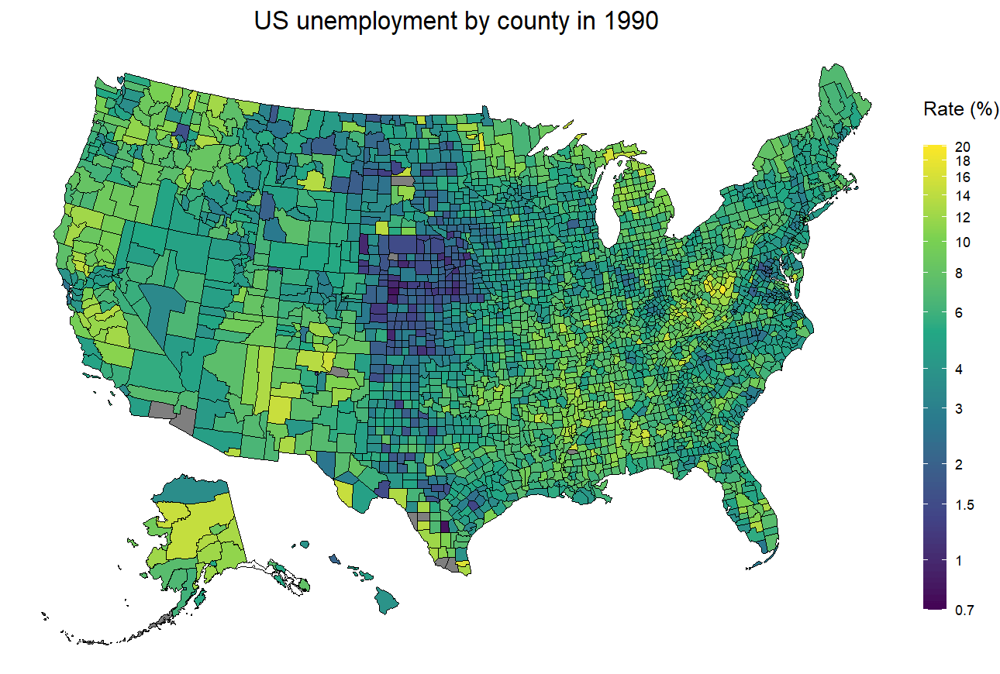

# BLS Unemployment Data

Source: [BLS LAUS page](https://www.bls.gov/lau/)

Scripts for downloading, cleaning, and visualizing annual county-level unemployment level data.

Animated gif:

[Interactive shiny visualization](https://bwu62.shinyapps.io/BLS_Unemployment/)
