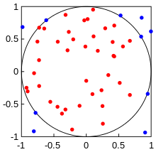

---
title:  "STAT340: Discussion 4: Monte Carlo"
author: "Names"
date:   "`r format(Sys.time(), '%d %B, %Y')`" # autogenerate date as date of last knit
documentclass: article
classoption: letterpaper
output:
  html_document:
    highlight: tango
    fig_caption: false
---

```{r setup, include=FALSE}
# if sourced, set working directory to file location
# added tryCatch in case knitting runs into error
tryCatch({
  if(Sys.getenv('RSTUDIO')=='1'){
    setwd(dirname(rstudioapi::getActiveDocumentContext()$path))
  }}, error = function(e){}
)

# install necessary packages
if(!require(pacman)) install.packages("pacman")
pacman::p_load(knitr,tidyverse)

knitr::opts_chunk$set(tidy=FALSE,strip.white=FALSE,fig.align="center",comment=" #")
```

---

[Link to source file](ds04.Rmd)

## Group Discussion (5-10 min)

As a group, briefly discuss the following questions!

1. So what is the defining feature of Monte Carlo methods? I.e. what makes a method "Monte Carlo"?
2. What are some advantages and drawbacks of Monte Carlo methods? List at least 2 of each.
3. What are some ways a Monte Carlo method can fail?

## Exercises (rest of discussion)

Now, break off into groups of 3-4 students. In your group, nominate one person to share your screen. As a group, **choose at least 2** of the following exercises to complete (you're welcome to choose more!)

**At the end, please delete any exercises or parts you did _not_ attempt before submitting!** This will help us grade more easily, thanks in advance!

As usual, **bonus parts are _optional_** but will **give extra statistical _EXP_**. Do them if you have time and like the challenge! 😃

---

1. Estimating $\pi$.
   a. Randomly generate $N$ pairs of points $(x,y)$ **uniformly** between $-1$ and $1$ for some large $N$ (at least $1000$, but the more the better!)
   b. Using R, plot the points as **small dots**, along with [the unit circle](https://ggforce.data-imaginist.com/reference/geom_circle.html) (i.e. circle centered at $(0,0)$ with radius 1) and a [square that circumscribes it](https://www.varsitytutors.com/hotmath/hotmath_help/topics/circles-inscribed-in-squares). Your result should look similar to this:
   <center></center>
   c. What proportion of your points lie inside the circle? ([Hint](https://math.stackexchange.com/questions/198764/how-to-know-if-a-point-is-inside-a-circle))
   d. How does this proportion relate to $\pi$, and how can you use it to estimate $\pi$?
   e. Calculate your [percentage error](https://www.mathsisfun.com/numbers/percentage-error.html) from the [true value](https://stat.ethz.ch/R-manual/R-devel/library/base/html/Constants.html).
   f. **Bonus**: can you increase the accuracy of your estimation by using more points? How low can you get the error?
   g. **Extra bonus**: Make a [**plot showing rate of convergence**](https://i.redd.it/08thk967jkm21.png) of your estimations, including both the value at each $N$, actual value (using a horizontal line), and the percentage error.

```{r}
# Do exercise 1 here

```

<br/>

---

2. Estimating [Robbin's constant](https://mathworld.wolfram.com/CubeLinePicking.html) (mean distance between points in a cube).
   a. Randomly generate 2 points $(x_1,y_1,z_1)$, $(x_2,y_2,z_2)$ **uniformly** in the unit cube a total of $N$ times (again, at least $1000$, but the more the better!)
      - hint: you can easily generate all the coordinates you need at once with `runif(6*N)`, then [reshape](https://stackoverflow.com/questions/17752830/r-reshape-a-vector-into-multiple-columns) as an $N\times 6$ matrix (one column for each coordinate component, with each row representing a pair of points) and then perform the arithmetic in the next step using the columns all at once to improve computational efficiency
      - if you are having difficulties with the above^ you can always use the naive way of running a for loop N times, where in each step of the loop you generate 2 points (6 coordinates total) and then perform the arithmetic in the next step
   b. Next, compute the standard [Euclidean distance](https://en.wikipedia.org/wiki/Euclidean_distance#Higher_dimensions) between each pair of points and find the mean distance. (Bonus: plot the distribution of these distances!)
   c. Calculate your [percentage error](https://www.mathsisfun.com/numbers/percentage-error.html) from the [true value](https://stat.ethz.ch/R-manual/R-devel/library/base/html/Constants.html).
   d. **Bonus**: can you increase the accuracy of your estimation by using more points? How low can you get the error?
   e. **Super bonus**: Repeat the above for another 2D or 3D object of your choice (how about a triangle or a sphere?)

```{r}
# Do exercise 2 here

```

<br/>

---

3. How many heads in a row should you see in $N$ flips of a fair coin?
   a. Start by randomly flipping a fair coin ($p=0.5$) a total of $N=10$ times (hint: use either `rbernoulli` function from `purrr` or `rbinom` with `n=10` and `size=1`) and record how many heads (defined as a value of $1$) in a row you observe (this has been implemented in the function `longestHeadRun` function below for you.
   b. Repeat the above step $M$ times (at least $1000$ times, but this time, don't use an extremely large $M$, since we will repeat the previous step for other values of $N$). What is the mean length of the largest run of heads in $10$ flips?
      - **NOTE**: $N$ here is the _**size of each experiment**_ (i.e. each experiment consists of $N$ flips), whereas $M$ is _**how many experiments**_ are performed. It is common in Monte Carlo methods to have different parameters governing each experiment vs how many experiments are performed. Increasing $N$ (number of flips in each experiment) will increase the mean-run-length, whereas increasing $M$ (number of experiments) will increase the precision of your estimate of the mean-run-length.
   c. Now, repeat the above (you may use the same $M$) for **at least 3** other values of $N$ (again, feel free to do more if you wish!). Display your results in a table.
      - **NOTE** this step should be easy if you've written your code with good style. I recommend writing a function that does all the above for any given $N$ and $M$ and maybe $p$, e.g. `findMeanRun = function(N,M,p=0.5){......}`. Then, for different values of $N$ and $M$ you can simply change the arguments given to the function, e.g. `findMeanRun(10,1000)` or `findMeanRun(20,1000)`, etc.
      - **ALSO NOTE** the above function syntax^ sets `N` and `M` as arguments to the function without default values, but sets `0.5` as the default value of the argument `p`. For a different example, [see this](https://www.javatpoint.com/r-function-default-arguments).
   d. Validate your results against other people's results (for example, [this post](https://math.stackexchange.com/a/1409539)). Are your results consistent with others?
   e. **Bonus**: run a few more values of $N$ and plot the results, showing the mean run length vs number of flips $N$. (bonus²: what happens if you increase $M$?)
   f. [**DoublePlusBonus**](https://en.wikipedia.org/wiki/Newspeak#:~:text=doubleplusgood%20%E2%80%94%20The%20word%20that%20replaced,as%20excellent%2C%20fabulous%2C%20and%20fantastic) if you still want MORE: Like [the post referenced above](https://math.stackexchange.com/questions/1409372/what-is-the-expected-length-of-the-largest-run-of-heads-if-we-make-1-000-flips/1409539#1409539), can you fit a smooth curve through the points?

```{r, results='hide'}
# given output of rbernoulli or rbinom (a vector of 0's and 1's)
# compute the length of the longest continuous run of 1's
longestHeadRun = function(trials){
  runs = rle(trials)
  return(max(c(0,runs$lengths[runs$values==1])))
}

# demo (output hidden for brevity)
longestHeadRun(c(0,0,0,0,0,0,0,0,0,0)) # returns 0
longestHeadRun(c(1,0,1,1,0,1,1,1,1,0)) # returns 4
```

```{r}
# Do exercise 3 here

```

<br/>

---

4. Estimating a $t$-distribution with $N-1$ degrees of freedom.
   a. Choose an arbitrary $\mu$ and $\sigma>0$ to **use for the rest of the problem** (you may choose the standard normal $N(0,1)$ if you _really_ wish, but where's the fun in that?).
   b. Start by sampling $N=2$ values from the normal distribution with mean $\mu$ and standard deviation $\sigma$ (note this counts as $1$ experiment) and calculate the $t$-statistic of your sample. Recall the $t$-statistic for a sample $X$ is defined as
   $$t=\frac{\overline{X}-\mu}{s/\sqrt{N}}~,~~~s=\sqrt{\frac{1}{N-1}\sum_{i=1}^{N}(X_i-\overline{X})^2}$$ where $\overline{X}$ is the sample mean and $s$ is the [**sample standard deviation**](https://www.khanacademy.org/math/statistics-probability/summarizing-quantitative-data/variance-standard-deviation-sample/a/population-and-sample-standard-deviation-review)
      - Make sure you're actually computing the $s$ for the sample, and NOT just using $\sigma$ here!
      - You can use the built-in `mean( )` and `sd( )`, but if you _really_ want to do a barebones-style Monte Carlo, feel free to compute the $t$-statistic manually.
      - **NOTE**: Similar to the note in exercise 3.b., $N$ here is the _**size of each experiment**_ and $M$ is _**how many experiments**_ are performed. Increasing $N$ gives a $t$-distribution with a different number of degrees of freedom (namely, $N-1$), whereas increasing $M$ gives a more accurate estimate of each distribution of degree $N-1$.
   c. Repeat the above step $M$ times (similar to exercise 3.b., use at least $1000$ times, but don't use an extremely large $M$ since we will repeat this for other values of $N$).
   d. You've just simulated drawing from a $t$-distribution with $N-1=1$ degree of freedom! Now plot the resultant values in a [density](https://www.r-graph-gallery.com/21-distribution-plot-using-ggplot2) plot.
   e. For comparison, plot the theoretical distribution with $1$ degree of freedom ([this page](https://t-redactyl.io/blog/2016/03/creating-plots-in-r-using-ggplot2-part-9-function-plots.html) may be helpful). For best results, overlay this on top of the previous plot, but you're having trouble with this, you can also plot them side-by-side.
   f. Repeat the above steps for **at least 3** other values of $N$ (for example 3, 6, 11, but feel free to choose your own or choose more than 3!). For each $N$, plot both your simulated distribution and the theoretical distribution.
      - **NOTE**: again, like the note in exercise 3.c., this should be easy if you used a function!
   g. **Bonus**: What do you notice about these distributions? What do they converge to and why?


```{r}
# Do exercise 4 here

```

<br/>

---

## Submission

As usual, make sure the **names of everyone** who worked on this with you is included in the header of this document. Then, **knit this document** and submit **both this file and the HTML output** on Canvas under Assignments ⇒ Discussion 4

