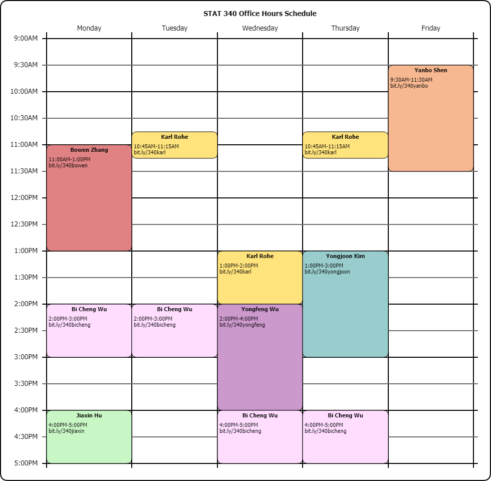
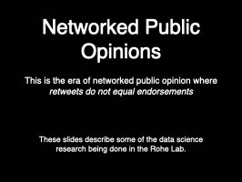

email: first name and last name at stat dott wisc dott edu  
office: 1239 MSC  
[Syllabus](syllabus.pdf), [text](text/worldDataModels.html),   [R labs](labs.R), and [Project description](projectDescription.html).

**Office Hours:**

### Week 2  

1) Why do we need statistical models? What is the point of modeling? [World, Data, Models (wdm)](text/worldDataModels.html)
2) Chapter 1 in wdm; random variables.

#### Homework

[homework1](chapter_01_random_variables/homework-01-generate_random_variables.Rmd) due February 10 in canvas. Note that the Rmd and html files for the homework can be found by just editing the web address from .Rmd to .html at the end.

### Week 1  
#### Topics 
1) This is a fun and important course because this is not an intro course.  It serves as a gateway to the "advanced" courses.  Moreover, we get to learn fundamental methodologies and play with data. 
2) [Go over syllabus](syllabus.pdf)
3) Let's begin with an example from my lab's research:

4) [What is data science?](http://pages.stat.wisc.edu/~karlrohe/dsthemes/)
5) I want you to begin to see data science as its own culture. It has a set of cultural practices to see the world with data.   
  - these practices create data and software to study data. 
  - moreover, these practices are emergent from the rich set of dependencies in the web of software and data.
3) Why do we need statistical models?  What is the point of modeling? [World, Data, Models](text/worldDataModels.html)

#### Lecture discussion questions
What type of thing are you interested in studying?  Topics? Do you think you could find data that you would find interesting?

#### Homework 

-  Form groups of three(ish). Within your group, you should have similar interests (i.e. project topics). Talk to your friends or look for group members in discussion section. If you cannot found a group, that is totally fine! We will have a *free agent* session in class.

#### Texts: 
[*An Introduction to Statistical Learning with Applications in R*](http://www-bcf.usc.edu/~gareth/ISL/)  
by Gareth James, Daniela Witten, Trevor Hastie and Robert Tibshirani  

For reference:  [*R for Data Science*](http://r4ds.had.co.nz) by Garrett Grolemund and Hadley Wickham

#### Helpful links
1) [Download ISLR text](http://www-bcf.usc.edu/~gareth/ISL/) and lab codes.   
4) Making beautiful documents with [R markdown](http://rmarkdown.rstudio.com).  [some](../ht/rmarkdown-cheatsheet.pdf) helpful [links](../ht/rmarkdown-reference.pdf).

#### Will we get to these topics?  
1) [Nonlinear regression; splines, lowess, generalized additive models](../ht/07-nonlinear.pdf)  
2) [Random Forests and tree based methods](../ht/08-trees.pdf)  
3) [k-means](../ht/10-unsupervised.pdf)  
